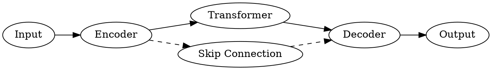

# Diagram & Figure Rendering Pipeline

## Overview

5-layer architecture for diagrams and figures in PowerPoint slides. SVG is the preferred output format (vector, scalable). PNG is fallback for extracted figures and TikZ without ghostscript.

| Layer | Engine | Best For | Output |
|-------|--------|----------|--------|
| 1 | Graphviz (DOT) | Architecture, flow, dependency, tree, comparison diagrams | SVG |
| 2 | Mermaid | Sequence, Gantt, pie, state, ER diagrams | SVG |
| 3 | TikZ | Math-intensive, geometric, paper-faithful reproductions | SVG/PNG |
| 4 | PptxGenJS shapes | Simple annotations, arrows, highlights (no rendering needed) | Native |
| 5 | PDF extraction | Figures from papers (pdftoppm + Pillow crop) | PNG@300DPI |

---

## Layer 1: Graphviz (Primary)

DOT language — best for structural/relational diagrams.

**Common graph types:**
- `digraph` — directed graphs (architecture, pipelines, dependencies)
- `graph` — undirected graphs (networks, relationships)
- `subgraph cluster_*` — grouped/nested components

**Layout engines** (via `"engine"` field):
- `dot` (default) — hierarchical, top-to-bottom
- `neato` — spring model, undirected
- `fdp` — force-directed, large graphs
- `circo` — circular layouts

**LLM DOT writing guidelines:**
- Max ~15 nodes — beyond this, readability drops on slides
- Use `rankdir=LR` for horizontal flows, `rankdir=TB` for vertical hierarchies
- Use `subgraph cluster_*` for logical grouping (adds bordered box)
- Prefer labeled nodes, labelless edges (edge labels clutter)
- Use `shape=box` for processes, `shape=ellipse` for data, `shape=diamond` for decisions

**Theme injection:** `render_diagrams.py` auto-injects theme-colored defaults:
```dot
graph [bgcolor="transparent"];
node [style="filled,rounded", fillcolor="#F8F9FA", fontcolor="#1A1A2E",
      color="#0173B2", fontname="Calibri", fontsize=11];
edge [color="#4A4A5A", fontcolor="#4A4A5A", fontname="Calibri", fontsize=10];
```

**Example DOT:**


---

## Layer 2: Mermaid (Supplementary)

**Supported diagram types:**
- `sequenceDiagram` — actor interactions (≤6 participants)
- `gantt` — project timelines
- `pie` — proportional data
- `stateDiagram-v2` — state machines
- `erDiagram` — entity-relationship

**Theme configuration:** Auto-generated `mermaid-config.json` maps theme colors:
```json
{
  "theme": "base",
  "themeVariables": {
    "primaryColor": "#0173B215",
    "primaryTextColor": "#1A1A2E",
    "primaryBorderColor": "#0173B2",
    "lineColor": "#4A4A5A"
  }
}
```

**CLI:** `mmdc -i input.mmd -o output.svg -c config.json --backgroundColor transparent`

**Note:** Mermaid CLI (`@mermaid-js/mermaid-cli`) is optional. If `mmdc` is not installed, fall back to Graphviz or PptxGenJS shapes.

---

## Layer 3: TikZ (Escape Hatch)

Use only for:
- Math-intensive diagrams (coordinate systems, function plots)
- Geometric constructions
- Faithful reproduction of paper figures

Shares LaTeX compilation pipeline with `render_latex.py`. Auto-includes `tikz`, `amsmath`, `amssymb`, and common TikZ libraries (`arrows.meta`, `positioning`, `calc`, `shapes`, `fit`, `backgrounds`).

Theme colors available as `\pos`, `\neg`, `\emp`, `\fgcolor`.

---

## Layer 4: PptxGenJS Shapes (Native)

For simple annotations that don't need external rendering:
- Arrows connecting existing elements
- Highlight boxes / overlays
- Simple flow boxes (use `addFlow()` helper)
- Colored markers / badges

**When to use shapes vs Graphviz:**
- ≤5 nodes in a linear chain (no branching) → `addFlow()` shapes
- Any branching, cycles, subgraphs, or >5 nodes → Graphviz
- Simple highlight/annotation over existing content → shapes
- Standalone structural diagram → Graphviz

See `pptxgenjs-reference.md` → Shapes section for API.

---

## Layer 5: PDF Figure Extraction

Extract figures from research papers.

**Workflow:**
1. Identify target page(s) via `pdf_get_toc` / `pdf_read_pages`
2. Extract: `pdftoppm -png -r 300 -f PAGE -l PAGE paper.pdf diagrams/fig`
3. Optional crop via Pillow (fractional coordinates `[left, upper, right, lower]`)

**Resolution check:** <800px in any dimension → warn user about projection blur.

**Rules:**
- Always attribute source: `"Source: Author et al., Year"`
- Don't extract tables — rebuild with `addTable()`
- For multi-figure pages, use `crop` to isolate each figure

---

## `diagrams.json` Format

```json
[
  {
    "id": "d01-arch",
    "type": "graphviz",
    "code": "digraph G { rankdir=LR; A -> B -> C; }",
    "engine": "dot"
  },
  {
    "id": "d02-seq",
    "type": "mermaid",
    "code": "sequenceDiagram\n  Alice->>Bob: Hello\n  Bob-->>Alice: Hi"
  },
  {
    "id": "d03-tikz",
    "type": "tikz",
    "code": "\\begin{tikzpicture}\n  \\draw[->] (0,0) -- (2,1);\n\\end{tikzpicture}",
    "fg_color": "1A1A2E"
  },
  {
    "id": "d04-fig",
    "type": "extract",
    "source": "paper.pdf",
    "page": 5,
    "crop": [0.1, 0.15, 0.9, 0.65]
  }
]
```

**Fields:**
| Field | Required | Description |
|-------|----------|-------------|
| `id` | yes | Unique identifier (used in `addDiagram()` calls) |
| `type` | yes | `graphviz` \| `mermaid` \| `tikz` \| `extract` |
| `code` | graphviz/mermaid/tikz | Source code |
| `engine` | graphviz only | Layout engine: `dot`/`neato`/`fdp`/`circo` (default: `dot`) |
| `fg_color` | tikz only | Foreground hex color (default: theme primary) |
| `source` | extract only | Path to source PDF |
| `page` | extract only | Page number (default: 1) |
| `crop` | extract only | `[left, upper, right, lower]` fractions 0-1 |

---

## Manifest Format

Output: `diagrams/manifest.json`

```json
{
  "d01-arch": {
    "file": "diagrams/d01-arch.svg",
    "format": "svg",
    "width_pt": 504,
    "height_pt": 252
  },
  "d04-fig": {
    "file": "diagrams/d04-fig.png",
    "format": "png",
    "width_px": 1200,
    "height_px": 800,
    "dpi": 300
  }
}
```

Error entries contain `"error"` field instead of dimensions.

---

## Theme Color Mapping

The `--theme` flag injects colors from `T` constants into each engine:

| T constant | Graphviz target | Mermaid target |
|-----------|----------------|----------------|
| `ac.pos` | node border color | primaryBorderColor |
| `tx.pri` | node font color | primaryTextColor |
| `tx.sec` | edge color + font | lineColor |
| `bg.content` | node fill color | secondaryColor |
| `cardFill` | — | primaryColor |

TikZ: colors available as named LaTeX colors (`\pos`, `\neg`, `\emp`, `\fgcolor`).

---

## Embedding in Slides

Three helper functions (defined in `references/themes.md` script template):

```javascript
addDiagram(slide, id, y, targetH, maxW?)     // centered, auto-scale
addDiagramAt(slide, id, x, y, maxW, targetH) // positioned (two-column)
addFigure(slide, id, y, targetH, caption?)    // centered + source caption
```

All read from `diagrams/manifest.json`. SVG embedded as base64, PNG via file path.

---

## Troubleshooting

| Problem | Fix |
|---------|-----|
| `dot: command not found` | `brew install graphviz` |
| `mmdc: command not found` | `npm install -g @mermaid-js/mermaid-cli` (optional) |
| Graphviz default blue/black colors | Check `--theme` flag matches slide theme |
| SVG dimensions 0x0 | SVG lacks width/height attributes; check DOT output |
| Mermaid renders blank | Verify diagram syntax at mermaid.live |
| Extracted figure blurry | Source PDF may be low-resolution; try higher `page` DPI |
| TikZ compilation fails | Check LaTeX packages; standalone class required |
